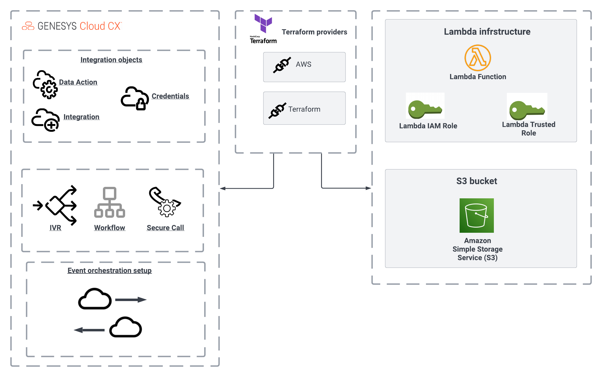

# Process Participant Attributes using Event Triggers(DRAFT)

This Genesys Cloud Developer blueprint demonstrates how to optimize call flows using the new trigger feature to execute a workflow whenever a call disconnects in your organization. The workflow then processes the participant data stored during the call.

