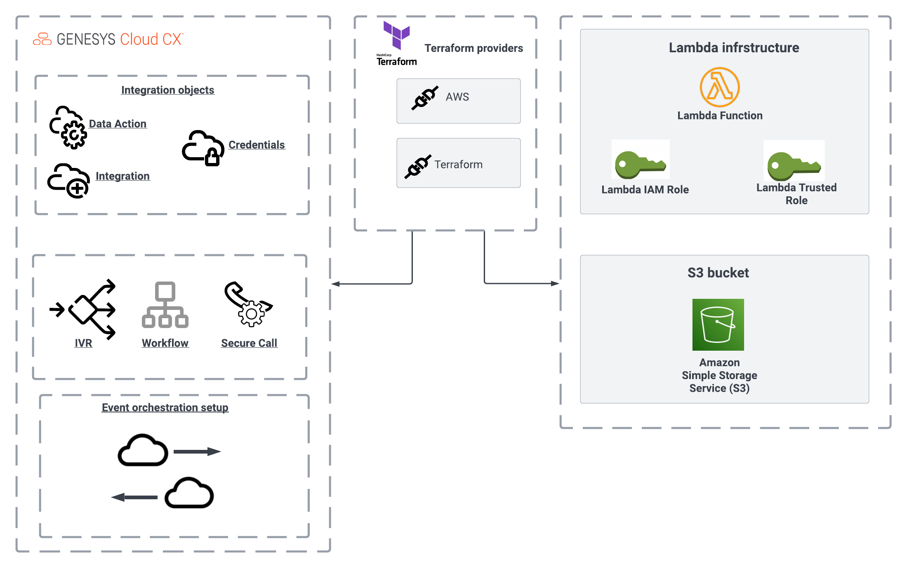

This Genesys Cloud Developer Blueprint demonstrates how to optimize call flows using the new trigger feature to execute a workflow whenever a call disconnects in your organization. The workflow then processes the participant data stored during the call.



:::primary:**NOTE**: `Process Automation Triggers` is currently in beta. Please ensure that you have the required access before you proceed. To gain access to this feature you should contact your CSM/TAM or Richard Schott at richard.schott@genesys.com.
:::

## Scenario

This Genesys Cloud Develop Blueprint demonstrates how to use event triggers to save participant attributes to an Amazon S3 bucket, which serves as a third-party database. To implement this solution, you use Terraform, CX as Code, and Archy. Terraform deploys the required AWS resources, Genesys Cloud resources, and Architect flows. Terraform also runs a Python script that creates a process trigger that defines the events or conditions that cause a workflow to execute. For this solution, the process trigger executes a workflow when a call is disconnected.

## Solution components

- **[Genesys Cloud CX](https://www.genesys.com/genesys-cloud "Goes to the Genesys Cloud CX page")** - A suite of Genesys cloud services for enterprise-grade communications, collaboration, and contact center management. You create and manage OAuth clients in Genesys Cloud.
- **[Archy](https://developer.genesys.cloud/devapps/archy/ "Goes to the Welcome to Archy page")** - A Genesys Cloud command-line tool for building and managing Architect flows.
- **[Terraform](https://www.terraform.io/ "Goes to the Terraform page")** - An open-source framework for managing cloud - and prem-based infrastructure services via a CLI.
- **[CX as Code](https://developer.genesys.cloud/api/rest/CX-as-Code/ "Goes to the CX as Code page")** - A Genesys Cloud Terraform provider that provides a command-line interface for declaring core Genesys Cloud objects.
- **[AWS Lambda](https://aws.amazon.com/lambda/ "Opens the AWS Lambda page")** - A serverless computing service for running code without creating or maintaining the underlying infrastructure.
- **[AWS S3](https://aws.amazon.com/s3/ "Opens the AWS S3 page")** - Simple Storage Service, an object storage service in AWS.
- **[Python](https://www.python.org/ "Opens the Python page")** - An interpreted, high-level programming language that is used to quickly build modularized, object-oriented programs.
- **[Golang](https://go.dev/ "Goes to the Download Golang page")** - A statically typed, compiled programming language that is syntactically similar to C, Go is a statically typed, compiled programming language designed at Google.

## Prerequisites

### Specialized knowledge

- Administrator-level knowledge of Genesys Cloud
- AWS Cloud Practitioner-level knowledge of AWS IAM, AWS Lambda, and AWS S3
- Experience with Terraform

### Genesys Cloud account

- A Genesys Cloud license. For more information, see [Genesys Cloud Pricing](https://www.genesys.com/pricing "Opens the Genesys Cloud pricing page") on the Genesys website.
- Master Admin role. For more information, see [Roles and permissions overview](https://help.mypurecloud.com/?p=24360 "Opens the Roles and permissions overview article") in the Genesys Cloud Resource Center.
- Archy (the latest version) Archy is Genesys Cloud's command line to deploy Genesys Cloud Architect Flows. For more information, see [Welcome to Archy](https://developer.genesys.cloud/devapps/archy/ "Goes to the Welcome to Archy page").
- CX as Code. For more information, see [CX as Code](https://developer.genesys.cloud/devapps/cx-as-code/ "Opens the CX as Code page") in the Genesys Cloud Developer Center.

### AWS user account

- An administrator account with permissions to access the following services:
  - AWS Identity and Access Management (IAM)
  - AWS Lambda
  - AWS S3

### Third-party software

- Terraform. For more information, see [Download Terraform](https://www.terraform.io/downloads "Goes to the DOwnload Terraform page") on the Terraform website.

- Python version 3.8.10 or later. For more information, see [Download Python](https://www.python.org/downloads/ "Goes to the Download Python page" ) on the Python website.

- Golang version go1.16 or later. For more information, see [Download GO](https://go.dev/dl/ "Goes to the Download GO page") on the Go website.

## Implementation steps

- [Clone the repository that contains the project files](#clone-the-repository-that-contains-the-project-files "Goes to the Clone the repository containing the project files section")
- [Create a role for administering Process Automation Triggers](#create-a-role-for-administering-process-automation-triggers "Goes to the Create a role for administering Process Automation Triggers section")
- [Create an OAuth Client Credentials Token in Genesys Cloud](#create-an-oauth-client-credentials-token-in-genesys-cloud "Create an OAuth Client Credentials Token in Genesys Cloud section")
- [Define the environment variables](#define-the-environment-variables "Define the environment variables section")
- [Deploy the infrastructure](#deploy-the-application "Goes to the Build and deploy the infrastructure section")
- [Building Golang Lambda](#building-golang-lambda "Goes to the building golang lambda section")
- [Test your infrastructure](#test-your-infrastructure)

### Clone the repository that contains the project files

Clone the [process-participant-attributes-event-triggers-blueprint](https://github.com/GenesysCloudBlueprints/process-participant-attributes-event-triggers-blueprint "Opens the process-participant-attributes-event-triggers-blueprint") repository from GitHub to your local environment.

### Create a role to administer process automation triggers

In Genesys Cloud, create a role that includes the following permission: `processautomation > trigger > All Permissions`. Assign this role to yourself so you can assign it to a client in the next step.

### Create an OAuth Client Credentials Token in Genesys Cloud

Step to create an OAuth client:

1. Click **Admin**.
2. Under **Integrations**, click **OAuth**.
3. Click **Add client**. The Client Details tab appears.
4. Set **App Name** to a descriptive name of the app.
5. (Optional) Type a brief description of the app in the Description box.
6. Next, set the duration of time until tokens created with this client expire. Accept the default duration, or enter a value between 300 and 172800 seconds. This sets the lifetime of the token to a maximum of 2 days or less.
7. Make a selection below **Grant Types**. rant Types set the way an application gets an access token.
- [Client Credential Grant](https://developer.genesys.cloud/authorization/platform-auth/use-client-credentials): A single-step authentication process exclusively for use by non-user applications (e.g. a Windows Service or cron job). The client application provides OAuth client credentials in exchange for an access token. This authorization type is not in the context of a user and therefore will not be able to access user-specific APIs (e.g GET /v2/users/me).

8. Supply parameters required by the grant type.

- **Roles**:  If you selected Client Credentials, click the Roles tab. This opens a list of roles to choose from. Assign a minimum set of roles to determine what your OAuth client integration can do.

:::primary
**Note**: To grant roles to an OAuth client, you must have those roles assigned to your profile.
:::

You must also associate each role with a division. Determine what divisions should be associated with roles for the Client Credential Grant. All Client Credential grant roles are scoped to the Home Division by default. Update with appropriate divisions so that the applications and systems which use those grants can access the appropriate data. If a client credential grant is supplied by a 3rd party, check with the 3rd party to understand the use of the grant and update the divisions for the roles appropriately. No other grant types are affected by access control.

9. Click **Save**. Genesys Cloud creates a Client ID and a Client Secret (token).

Your Genesys Cloud OAuth client is now ready to use.

For more information, see [Create an OAuth client](https://help.mypurecloud.com/?p=188023 "Goes to the Create an OAuth client article") in the Genesys Cloud Resource Center.

### Define the environment variables

- **GENESYSCLOUD_OAUTHCLIENT_ID**: This is the Genesys Cloud client credential grant ID that CX as Code executes against.
- **GENESYSCLOUD_OAUTHCLIENT_SECRET**: This is the Genesys Cloud client credential secret that CX as Code executes against.
- **GENESYSCLOUD_REGION**: This is the Genesys Cloud region in your organization (For example, us-east-1).
- **GENESYSCLOUD_ENVIRONMENT**: This is where your organization is hosted (For example, mypurecloud.com).
- **AWS_ACCESS_KEY_ID**: This is the AWS access key that you must set up in your Amazon account to allow the AWS Terraform provider to act against your account.
- **AWS_SECRET_ACCESS_KEY**: This is the AWS secret you must set up in your Amazon account to allow the AWS Terraform provider to act against your account.

:::primary
**Note:** For this project, the Genesys Cloud OAuth client was given the Master Admin role.
:::

### Define Terraform variables

You must define several variables that are specific to your AWS region and Genesys Cloud organization.

In the blueprint/terraform/variables.auto.tfvars file, set the following values: 

- `environment`: This is a free-form field that will be combined with the prefix value to define the name of various AWS and Genesys Cloud resources. For example, if you set the environment name as `dev` and a Lambda prefix as `saveDataLambda`, your AWS Lambda, IAM roles, Genesys Cloud integration, and data actions will all begin with `dev-saveDataLambda`.
- `organizationId`: Your Genesys Cloud organization ID.
- `aws_region`: The AWS region (For example, us-east-1, us-west-2) where you are going to deploy the target Lambda.
- `saveData_prefix`: This is a free-form field that combines with the environment variable to define the name of various AWS and Genesys Cloud resources.
- `generatePaymentId_prefix`: This is a free-form field that combines with the environment variable to define the name of various AWS and Genesys Cloud resources.
- `bucket_name`: Preferred name of the S3 bucket. Make sure the bucket name is [valid](https://docs.aws.amazon.com/AmazonS3/latest/userguide/bucketnamingrules.html "Opens the Bucket naming rules page").
- `bucket_tag`: Tag to assign to S3 bucket.
- `IVR_start_number`: Starting phone number of the DID Pool range.
- `IVR_end_number`: Ending phone number of the DID Pool range.

:::primary
**Note:** Use a phone number that you want to associate with the IVR. For testing purposes, the  `IVR_start_number` and `IVR_end_number` can be the same number.

If you have an existing DID pool range you want to use, open the `telephony.tf` file and comment out the `genesyscloud_telephony_providers_edges_did_pool` resource. Then in the `genesyscloud_architect_ivr` resource, comment out the `depends_on` property. Save your changes.
:::

### Create and deploy the infrastructure

1. To run this project using AWS the Terraform provider, open a Terminal window and change to the `terraform` directory. Then run the following command:

```bash
terraform init
terraform apply --auto-approve
```

The infrastructure includes:
 - (an inbound call flow, a secure flow, and a workflow), two Lambdas (including the roles and policies), data integrations, and data actions. 
 
 The Python script in `blueprint/terraform/workflow_trigger` is called with the ID of the workflow. This is a crucial part of the infrastructure because the script subscribes to a Notification topic (with your `workflowId`) that allows the workflow to be called when a call is disconnected.

### Build the Golang Lambda

This blueprint includes prebuilt Go Lambdas. The command to build Golang Lambda for AWS is `GOOS=linux GOARCH=amd64 go build -o <binary-destination>`. If you decide to change or replace the Lambda code, the code has to be built before deployment. For example, if you make changes to `blueprint/lambda-paymentIdGenerator/cmd/main.go`, you have to open the terminal and set the working directory to `blueprint/lambda-paymentIdGenerator/cmd`. Then run the following command:

```bash
GOOS=linux GOARCH=amd64 go build -o ../bin/main
```

## Test your setup

Dial the number you entered in the `blueprint/src/terraform/variables.auto.tfvars` file. Once the IVR picks up, you should hear the following response of **Welcome to the cloud store**. If you receive this response, the setup has been deployed correctly. When the call ends, you should see your phone number and a randomly generated payment ID saved in your deployed s3 bucket.

## Additional resources

- [Genesys Cloud Provider](https://registry.terraform.io/providers/MyPureCloud/genesyscloud/latest/docs "Goes to the Genesys Cloud provider page") on the Terraform website
- [AWS Provider](https://registry.terraform.io/providers/hashicorp/aws/latest/docs "Go to the AWS provider page") on the Terraform website
- [Deploy a simple IVR using Terraform, CX as Code, and Archy](https://developer.genesys.cloud/blueprints/simple-ivr-deploy-with-cx-as-code-blueprint/ "Goes to Deploy a simple IVR using Terraform, CX as Code, and Archy blueprint") in the Genesys Cloud Developer Center
- [process-participant-attributes-event-triggers-blueprint](https://github.com/GenesysCloudBlueprints/process-participant-attributes-event-triggers-blueprint "Goes to the Process participant attributes event triggers blueprint") in Github
AWS credentials. For more information setting up your AWS credentials on your local machine, see [Configuration](https://docs.aws.amazon.com/sdkref/latest/guide/creds-config-files.html "Goes to the Configuration page") on the AWS website
